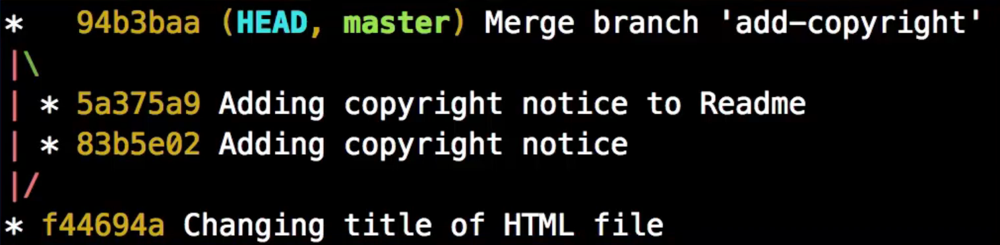

# Branching and merging

* Feature/topic branch should be created and then merged in to master

## `git branch` command

* `git branch branch_name` - creates a new branch named `branch_name`
* `git branch` - Lists all local branches
* `git branch -a` - lists all the branches including remote branches
* `git branch --merged` - Lists all the branches merged with the current branch. `git branch --no-merged` will list all those branches that are not merged on to the current branch.
* `git branch -D branch_name` - Deletes the branch
* `git branch -m old_name new_name` - Rename a branch
* `git branch existing_branch_name -u <upstream_branch>` - This makes the `existing_branch_name` track the `upstream_branch`. `git pull`  when on the `existing_branch_name` pulls the changes from this upstream branch.

## `git checkout` command

* `git checkout -b branch_name remote_branch` - This command creates new branch that will be having the same state as that of the remote branch.

* `git checkout branch_name` - This command is used to switch from current branch to the `branch_name`

## `git merge` command

* `git diff/difftool branch1 branch2` - shows the  difference between the two branches. We can use this command to see the differences before merging one branch in to another.

### Fast forwarding

* While we are in the current branch, if we type `git merge src_branch` this will get all the commits from the `src_branch` and add it on top of the `current_branch`. This is referred to as **fast forwarding**.

* Fast forwarding is **possible only when the merged-in history is already a descendant of the current history**.

* If we want to retain all the commits added on merged branch and add only a merge commit to the `current_branch`, we need to disable fast forwarding. `git merge src_branch --no-ff` will disable fast forwarding and add only a merge commit to the current_branch. `git log --all --graph --oneline --decorate` can be used to visualize the merge commit along with the branching.

* `git merge src_branch --ff-only` - Use only fast forward to merge. If unable to merge using fast forward, do not merge.

### `git merge --no-commit`

When not using fast forwarding `--no-ff`(or when fast forward is not possible) and with `--no-commit` option, git performs the merge and stops just before creating a merge commit, to give the user a chance to inspect and further tweak the merge result before committing.

## Squash merge

Here all the commits from the `src_branch` is squashed in to single commit and added on top of the current branch. The `git log` graph will be linear as if only one merge commit happened. `git merge src_branch --no-ff --squash`

> --squash - Produce the working tree and index state as if a real merge happened, but do not actually make a commit, move the HEAD, or record `$GIT_DIR/MERGE_HEAD` (to cause the next git commit command to create a merge commit). This allows you to create a single commit on top of the current branch whose effect is the same as merging another branch.

---

## References

* [Squash commit](https://stackoverflow.com/questions/5308816/how-to-use-git-merge-squash)
